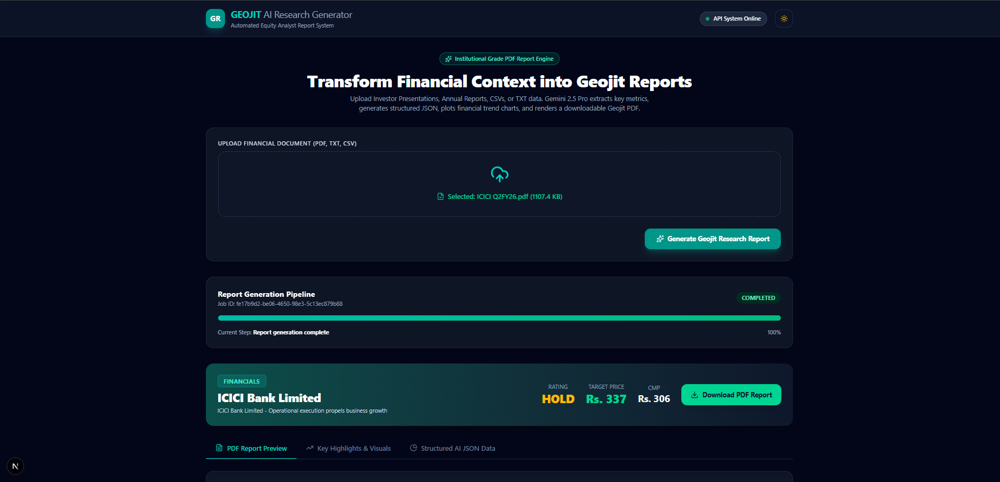
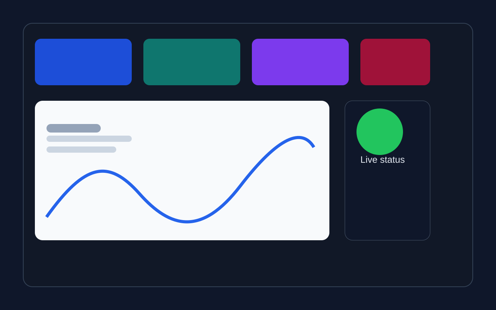
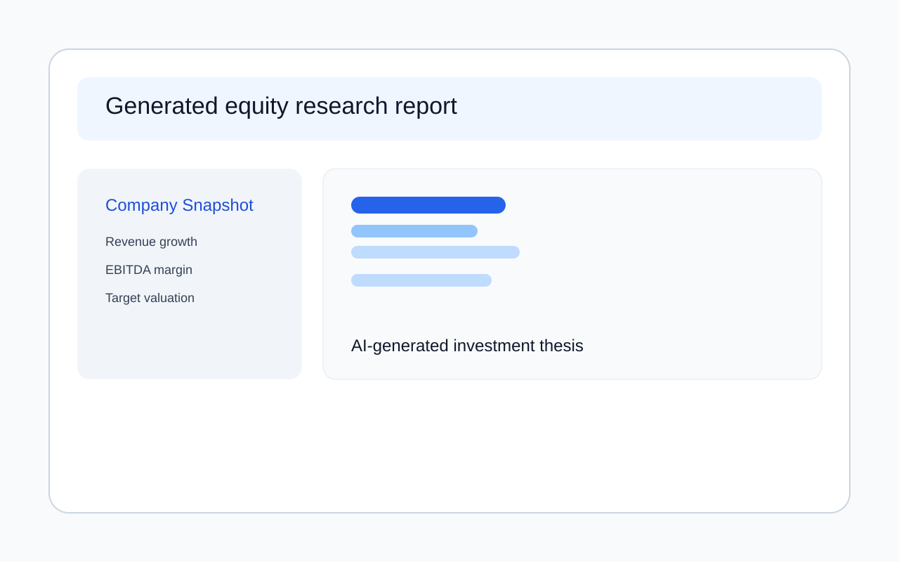
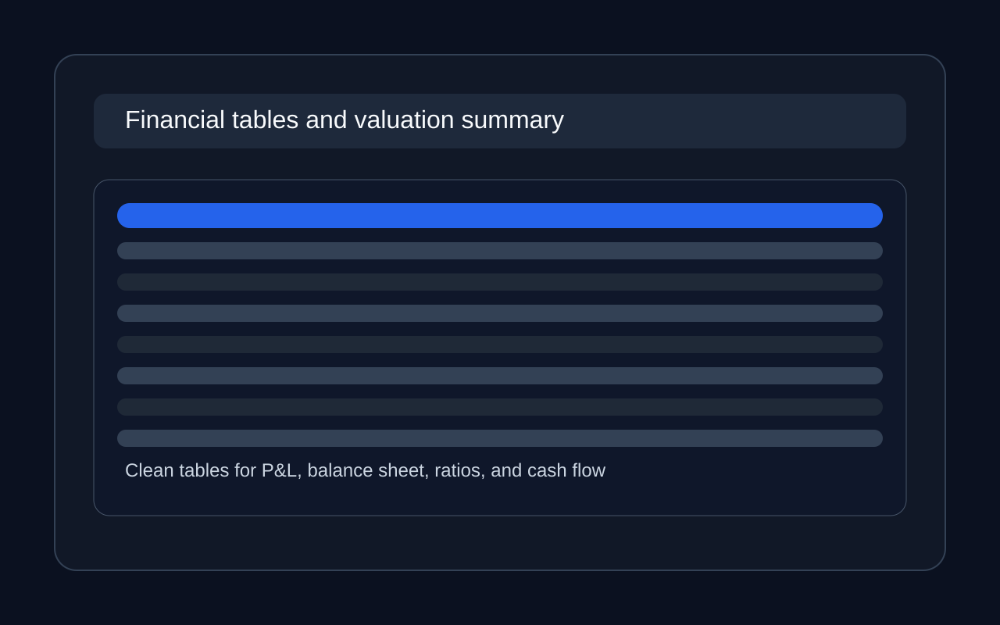

<div align="center">

<h1>📊 SmartResearch AI</h1>

<p>
  <strong>An AI-powered Equity Research Report Generator that mimics institutional-grade financial reports — just like Geojit, Motilal Oswal, ICICI Securities, and HDFC Securities.</strong>
</p>

<p>
  <a href="#features"></a>
  <a href="#tech-stack"></a>
  <a href="#tech-stack"></a>
  <a href="#tech-stack"></a>
  <a href="LICENSE"></a>
</p>

<p>
  
</p>

</div>

---

## 🚀 What is SmartResearch AI?

**SmartResearch AI** is NOT a PDF summarizer.

It is a **multi-agent AI financial analyst** that accepts uploaded investor presentations, annual reports, quarterly results, and earnings call transcripts — and automatically generates a full **professional equity research report**, complete with:

- Company Profile & Business Overview
- Key Financial Metrics (Revenue, EBITDA, PAT, EPS, ROE, ROCE)
- Quarterly Performance Deep-Dive (YoY & QoQ analysis)
- Investment Thesis (evidence-based BUY / HOLD / SELL rationale)
- Categorized Risk Matrix & SWOT Analysis
- Future Outlook & Valuation Summary
- 5-Year Financial Statement Tables (P&L, Balance Sheet, Cash Flow, Ratios)
- Change in Estimates Tables
- Auto-generated Charts (Revenue Trend, EBITDA Margin, PAT, GOV)

The report output closely mirrors the structure and depth of **institutional equity reports** published by firms like Geojit BNP Paribas.

---

## 🎬 Demo

> ⚠️ Screenshots and sample PDF are available in the [`docs/`](./docs/) folder.

| Dashboard & Upload | Generated Report — Page 1 | Financial Tables — Page 4 |
|---|---|---|
|  |  |  |

### 📄 Sample Generated Report
> [📥 Download Sample Report PDF](docs/demo/sample_report.pdf)

---

## ✨ Features

### 🤖 8-Agent Multi-Agent AI Pipeline

| Agent | Responsibility |
|---|---|
| `CompanyProfileAgent` | Extracts company name, sector, business model, revenue segments |
| `FinancialMetricsAgent` | Pulls all KPIs — Revenue, EBITDA, PAT, EPS, ROE, ROCE, Margins |
| `QuarterlyPerformanceAgent` | Deep-dives into QoQ/YoY revenue, margin & operational performance |
| `InvestmentThesisAgent` | Generates 5–8 evidence-based thesis points with BUY/HOLD/SELL rationale |
| `RisksAgent` | Categorizes Business, Financial, Regulatory, Execution & Industry risks with SWOT |
| `FutureOutlookAgent` | Extracts management guidance and derives target price & valuation methodology |
| `FinancialTablesAgent` | Builds 5-year P&L, Balance Sheet, Cash Flow, and Ratio tables |
| `ChartGeneratorService` | Renders Revenue Trend, EBITDA Margin, PAT Margin & GOV bar+line charts |

### 🧠 Intelligent Fallbacks
Every agent has a **heuristic/regex-based fallback** — if the Gemini API quota is exhausted or the key is missing, the pipeline still generates a meaningful report using pattern extraction directly from the document.

### 📑 Professional Report Output
- PDF generation via **WeasyPrint** with a fully custom Geojit-style HTML template
- Multi-page layout with stock snapshot, charts, financial tables, and analyst sections
- Consistent institutional typography and color system

### ⚡ Async Architecture
- **FastAPI** backend with async task polling
- Report generation runs as a non-blocking background task
- Polling endpoint so the frontend stays responsive during long generations

---

## 🏗️ Architecture

```
┌─────────────────────────────────────────────────────────────────┐
│                        SmartResearch AI                         │
├───────────────────────┬─────────────────────────────────────────┤
│     Next.js Frontend  │          FastAPI Backend                │
│  ┌─────────────────┐  │  ┌──────────────────────────────────┐   │
│  │  Upload PDF/TXT │──┼─▶│  DocumentParserService           │   │
│  │  Poll Status    │  │  │  (Section Detection + Tables)    │   │
│  │  View Report    │  │  └────────────┬─────────────────────┘   │
│  └─────────────────┘  │               │                         │
│                        │  ┌────────────▼────────────────────┐   │
│                        │  │  LLMExtractionService           │   │
│                        │  │  (Multi-Agent Orchestrator)     │   │
│                        │  │                                 │   │
│                        │  │  Agent 1: CompanyProfile        │   │
│                        │  │  Agent 2: FinancialMetrics      │   │
│                        │  │  Agent 3: QuarterlyPerformance  │   │
│                        │  │  Agent 4: InvestmentThesis      │   │
│                        │  │  Agent 5: Risks & SWOT          │   │
│                        │  │  Agent 6: FutureOutlook         │   │
│                        │  │  Agent 7: FinancialTables       │   │
│                        │  └────────────┬────────────────────┘   │
│                        │               │                         │
│                        │  ┌────────────▼────────────────────┐   │
│                        │  │  ChartGeneratorService          │   │
│                        │  │  (Matplotlib/Plotly Charts)     │   │
│                        │  └────────────┬────────────────────┘   │
│                        │               │                         │
│                        │  ┌────────────▼────────────────────┐   │
│                        │  │  PDFGeneratorService            │   │
│                        │  │  (WeasyPrint + Jinja2 Template) │   │
│                        │  └─────────────────────────────────┘   │
└───────────────────────┴─────────────────────────────────────────┘
```

---

## 🛠️ Tech Stack

| Layer | Technology |
|---|---|
| **Backend API** | [FastAPI](https://fastapi.tiangolo.com/) + Uvicorn |
| **AI Engine** | [Google Gemini 2.5 Flash / Pro](https://ai.google.dev/) via `google-genai` |
| **PDF Parsing** | PyMuPDF (`fitz`), pdfplumber, Camelot |
| **PDF Generation** | WeasyPrint + Jinja2 HTML Templates |
| **Charts** | Matplotlib, Plotly |
| **Frontend** | [Next.js 15](https://nextjs.org/) + TypeScript |
| **Database** | SQLite (default) / PostgreSQL (Docker) |
| **Containerization** | Docker + Docker Compose |
| **Data Validation** | Pydantic v2 |
| **Logging** | Structlog |

---

## 📁 Project Structure

```
SmartResearch-AI/
├── app/
│   ├── agents/                    # 8 Specialized AI Agents
│   │   ├── base_agent.py          # BaseAIAgent with quota tracking & fallback
│   │   ├── company_profile_agent.py
│   │   ├── financial_metrics_agent.py
│   │   ├── quarterly_performance_agent.py
│   │   ├── investment_thesis_agent.py
│   │   ├── risks_agent.py
│   │   ├── future_outlook_agent.py
│   │   └── financial_tables_agent.py
│   ├── api/                       # FastAPI route handlers
│   ├── core/                      # Config, logging, settings
│   ├── models/                    # SQLAlchemy database models
│   ├── schemas/                   # Pydantic schemas for all agents
│   ├── services/
│   │   ├── document_parser.py     # PDF/TXT parsing with section detection
│   │   ├── llm_extractor.py       # Multi-agent orchestrator
│   │   ├── chart_generator.py     # Chart rendering service
│   │   └── pdf_generator.py       # WeasyPrint PDF builder
│   ├── templates/
│   │   └── geojit_template.html   # Institutional report HTML template
│   └── main.py                    # FastAPI app entry point
├── frontend/                      # Next.js 15 frontend
│   ├── app/                       # App Router pages
│   └── public/
├── tests/                         # Pytest test suite
├── docs/
│   ├── screenshots/               # UI screenshots (add yours here)
│   └── demo/                      # Sample generated PDF (add yours here)
├── docker-compose.yml             # Full stack Docker setup
├── Dockerfile                     # Backend Docker image
├── requirements.txt               # Python dependencies
├── .env.example                   # ← Copy this to .env and fill in your API key
└── README.md
```

---

## ⚡ Quick Start

### Prerequisites

- Python 3.11+
- Node.js 20+
- A **[Google Gemini API Key](https://aistudio.google.com/app/apikey)** (free tier works)

---

### 1. Clone the Repository

```bash
git clone https://github.com/Manish9383/SmartResearch-AI.git
cd SmartResearch-AI
```

---

### 2. Backend Setup

```bash
# Create and activate virtual environment
python -m venv venv

# Windows
venv\Scripts\activate

# macOS / Linux
source venv/bin/activate

# Install dependencies
pip install -r requirements.txt
```

---

### 3. Configure Environment Variables

```bash
# Copy the example file
cp .env.example .env

# Open .env and paste your Gemini API key
# GEMINI_API_KEY=your_actual_gemini_api_key_here
```

> 🔑 Get your free Gemini API key at: https://aistudio.google.com/app/apikey

---

### 4. Start the Backend

```bash
python -m app.main
```

The API will be live at: **http://localhost:8000**  
Interactive API docs: **http://localhost:8000/docs**

---

### 5. Frontend Setup

```bash
cd frontend
npm install
npm run dev
```

The UI will be live at: **http://localhost:3000**

---

### 6. (Optional) Docker — Full Stack

```bash
docker-compose up --build
```

This starts the FastAPI backend, SQLite database, and Redis in containers.

---

## 📖 How to Use

1. **Open** http://localhost:3000 in your browser.
2. **Upload** a company document — annual report, quarterly results PDF, earnings transcript, or investor presentation.
3. **Wait** for the multi-agent pipeline to process your document (takes 30–90 seconds depending on document length).
4. **View** the fully generated institutional equity research report in your browser.
5. **Download** the report as a professional PDF.

---

## 🔌 API Reference

| Method | Endpoint | Description |
|---|---|---|
| `POST` | `/api/v1/report/generate` | Upload document & trigger report generation |
| `GET` | `/api/v1/report/{report_id}` | Poll status and fetch completed report |
| `GET` | `/api/v1/reports` | List all generated reports |
| `GET` | `/api/v1/report/{report_id}/pdf` | Download report as PDF |
| `DELETE` | `/api/v1/report/{report_id}` | Delete a report |

Full interactive documentation available at: **http://localhost:8000/docs**

---

## 🔮 Roadmap

- [ ] Support for Excel / CSV financial statements upload
- [ ] Streaming report generation with live section-by-section preview
- [ ] Multi-company comparison reports
- [ ] Email delivery of completed reports
- [ ] Claude / OpenAI model support alongside Gemini
- [ ] Sector-specific report templates (Banking, Pharma, IT)
- [ ] DCF Valuation model auto-builder

---

## 🤝 Contributing

Contributions are welcome! Please follow these steps:

1. Fork the repository
2. Create your feature branch: `git checkout -b feature/amazing-feature`
3. Commit your changes: `git commit -m 'Add amazing feature'`
4. Push to the branch: `git push origin feature/amazing-feature`
5. Open a Pull Request

---

## ⚠️ Disclaimer

> This tool is for **educational and research purposes only**. The generated reports are AI-created and should **not** be used as investment advice. Always consult a licensed financial advisor before making investment decisions.

---

## 📝 License

This project is licensed under the **MIT License** — see the [LICENSE](LICENSE) file for details.

---

<div align="center">

Made with ❤️ by [Manish](https://github.com/Manish9383)

<strong>⭐ Star this repo if you find it useful!</strong>

</div>
